# RESTful Schema-Aware Data Integration & Transformation API
## RESTful Schema-Aware Data Integration & Transformation API
 A Final Project Presentation By: 
1. Aaron Paul
2. Athuljith S
3. Dijith Dinesh
4. Peter Joe Menachery
5. Pranav Manoj

## Introduction: Project Domain
* **Domains**
   - Backend Services
   -   Data Integration
   -   RESTful APIs

*   It provides a foundational middleware solution that can be used by any application needing to expose database information securely and efficiently over the web.

## Introduction: Problem Statement
*   In modern software, client applications are often **tightly coupled** to the backend database schema.

*   This means a minor change in the database (like renaming a column) can cause a **cascade of failures** in all connected applications.

*   This "brittleness" leads to fragile systems, high maintenance costs, and significant developer inefficiency.

## Introduction: Objectives
*   To **decouple** client applications from the physical database structure.

*   To **abstract** away the complexity of SQL with a simple, intuitive URL-based query language.

*   To implement **on-the-fly data transformation** into multiple formats (JSON, CSV, XML).

*   To enforce **robust, role-based security** using API keys.

## Introduction: Technologies Used
*   **Programming Language:** A pure Object-Oriented design in **Java (JDK 11+)**.

*   **Core Libraries:** We intentionally used only standard Java libraries to build a lightweight, dependency-free application.
    *   **Networking:** `com.sun.net.httpserver`
    *   **Database:** `JDBC` (Java Database Connectivity)

*   **Database:** **SQLite** for portability, with a design that allows easy migration to PostgreSQL or MySQL.

## Proposed System: Overview of Our Solution
*   We have built a **Universal Data Gateway**.

*   It is a standalone, intelligent API server that acts as a middleware between any client application and a database.

*   Clients communicate with our server using simple HTTP requests, and our server handles all the complex database interactions internally.

## Proposed System: How It's Better
*   **Decoupling:** Unlike traditional systems, if the database schema changes, only an API mapping needs to be updated. No client-side code has to be touched.

*   **Efficiency:** It eliminates repetitive, error-prone data-handling code on the client side by centralizing all data logic on the server.

*   **Flexibility:** Provides on-demand data transformation, allowing different clients to consume data in the exact format they need without any effort.

## Proposed System: Key Features
*   **Dynamic Query Engine:** Filter, sort, paginate, and select fields directly from the URL.

*   **On-the-Fly Data Transformation:** Request data in JSON, CSV, XML, HTML, or Markdown.

*   **Schema-Aware Views:** Dynamically rename data fields to match client-side models.

*   **Role-Based Access Control (RBAC):** Secure endpoints with distinct read-only, write, and admin-level API keys.

## Block Diagram / Architecture Diagram

  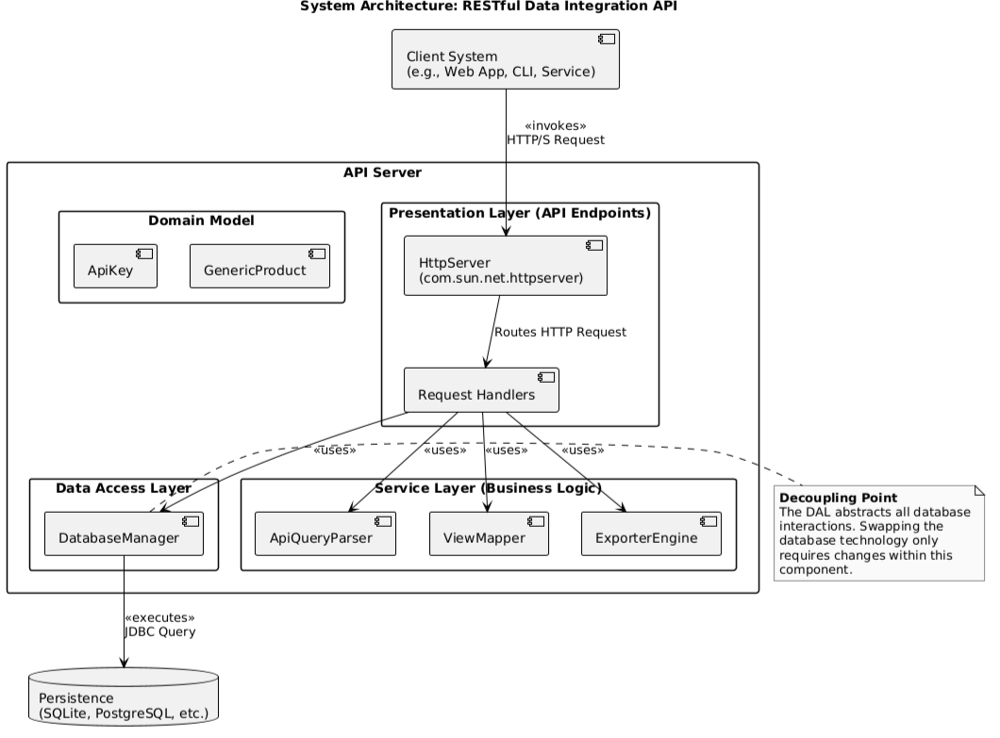

## Module Description
   The project is organized into several distinct modules, each with a single, clear responsibility.

*   **`server` Module:** The Presentation Layer. Handles all incoming HTTP traffic and routes requests.

*   **`util` Module:** The "brains" of the application. Securely parses URLs into SQL and handles data translation.

*   **`db` Module:** The Data Access Layer. The *only* module that communicates with the database, encapsulating all JDBC logic.

*   **`export` Module:** The Transformation Engine. Formats data into JSON, CSV, etc., on demand.

## Design Diagrams: Overview
*   To ensure a robust and maintainable system, we used several industry-standard **UML and Data Flow diagrams** during the design phase.

*   These diagrams act as the **blueprint** for our application's architecture and logic.

*   The following slides will showcase the key diagrams we created.

## Design: Use Case Diagram
*   This diagram shows how actors (Client Developer, Administrator) interact with the system's core functionalities.

  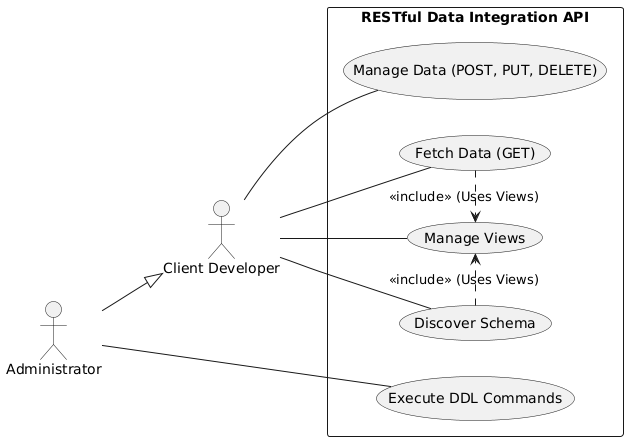

## Design: Class Diagram
*   This is the essential blueprint of our OOP design, detailing all classes, their attributes, methods, and the relationships between them.

  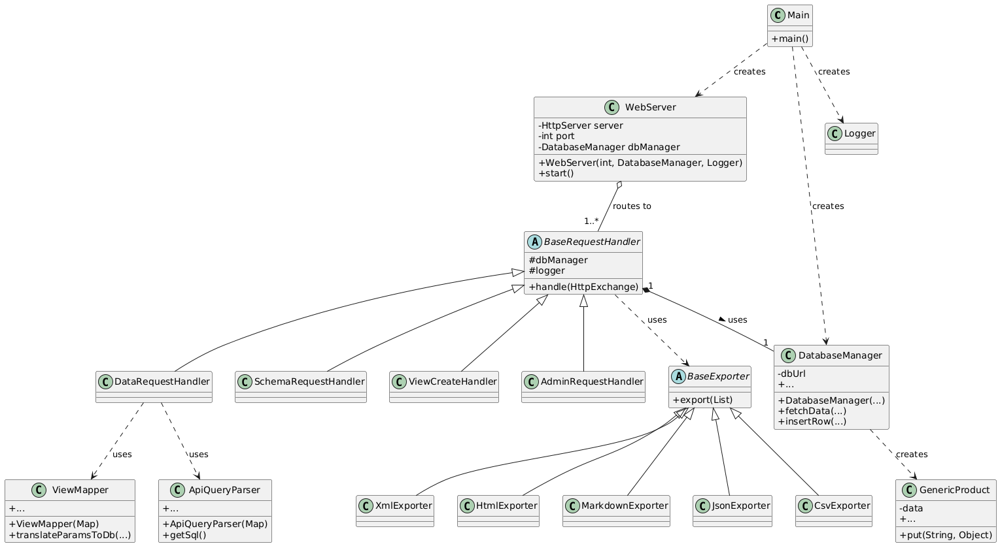

## Design: Data Flow Diagrams (DFD)
*   **DFD Level 0:** Shows the entire system as a single process.
*   **DFD Level 1:** Details the major internal processes and data stores.

    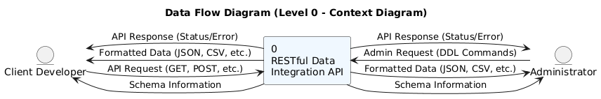
    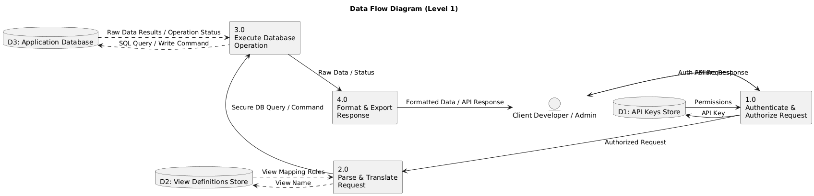

## Design: Activity Diagram (Data Request)

  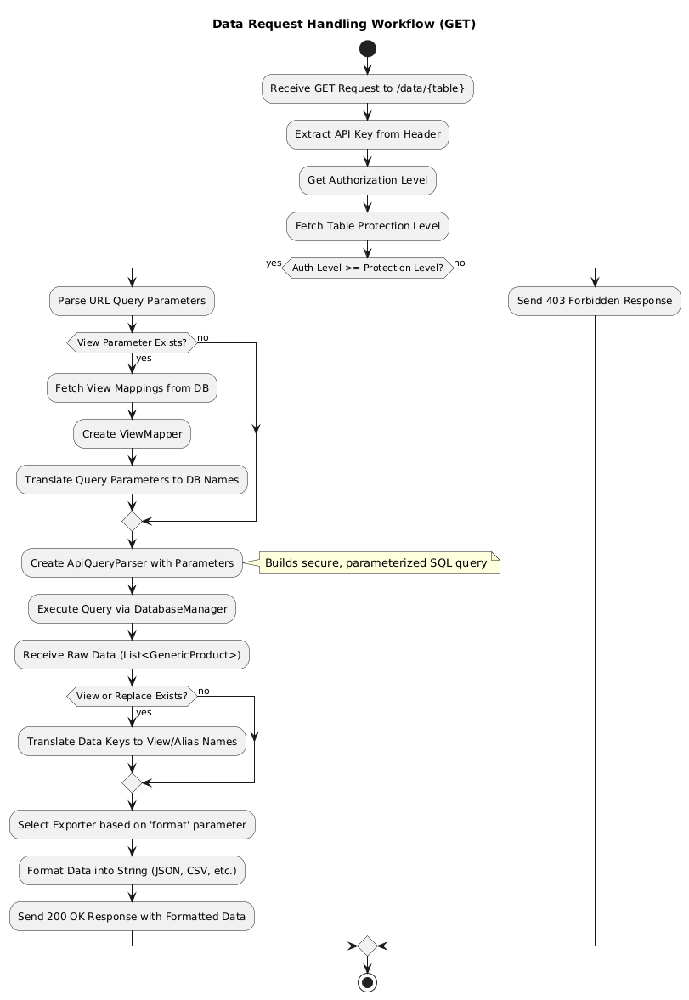

## Design: Activity Diagram (Data Modification)
*   This flowchart details the process for handling write operations like POST, PUT, and DELETE.

  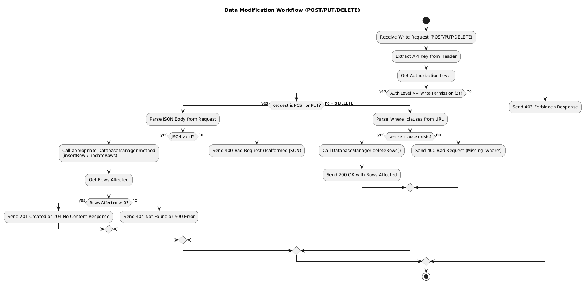

## Design: OOP Principles in Action
*   **Encapsulation:** The **`DatabaseManager`** hides all complex database logic and exposes only a clean, simple interface.

*   **Inheritance:** All request handlers **extend** a common **`BaseRequestHandler`** to inherit and reuse critical code.

*   **Polymorphism (Strategy Pattern):** The **`BaseExporter`** and its subclasses (`JsonExporter`, `CsvExporter`) allow for flexible, runtime selection of the data format.

*   **Abstraction:** The entire API is an **abstraction layer** over the database. The client is shielded from all underlying complexity.

## Implementation: Server Startup 
*   This screenshot shows the live console output when the server starts.

  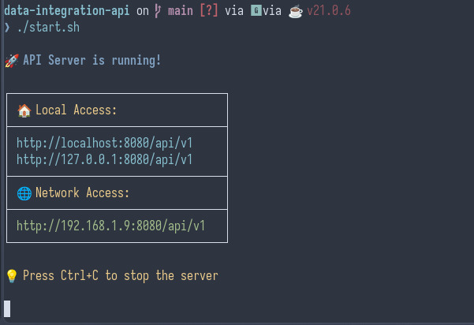

## Implementation: Server  Logging
*   This screenshot shows the live console output   and real-time request logging
*   helpful for later debugging and error resolving.

  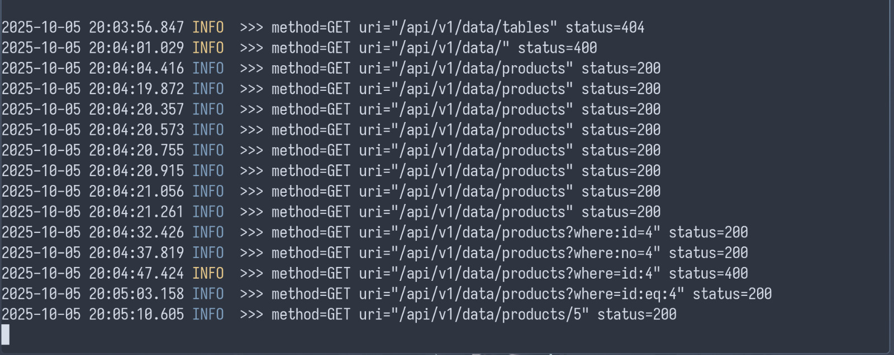

## Implementation: POST Request
*   Here, a `PUT` request is sent via `curl` to update a product detail, demonstrating the write capabilities of the API.

  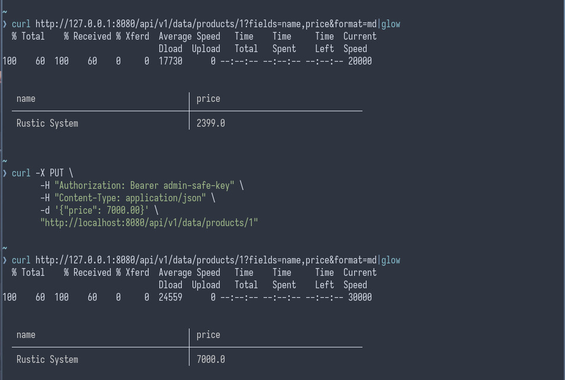

## Implementation: JSON Output
*   This shows the default data output format. The API returns a clean, well-structured JSON array.

  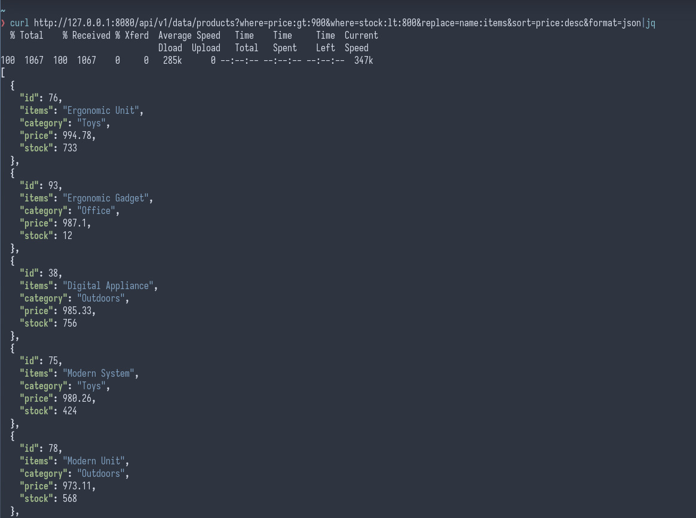

## Implementation: CSV Output
*   By simply adding `?format=csv` to the URL, the same data is returned in CSV format, ready for spreadsheets or data analysis tools.

  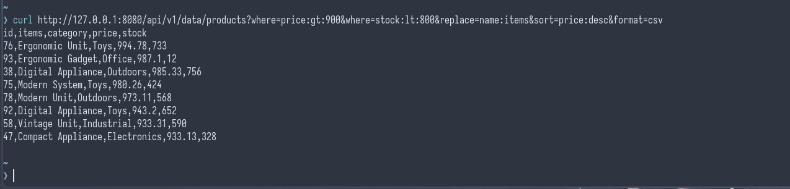

## Implementation: HTML Output
*   Using `?format=html`, the API generates a user-friendly, formatted HTML table for easy viewing in a web browser.

  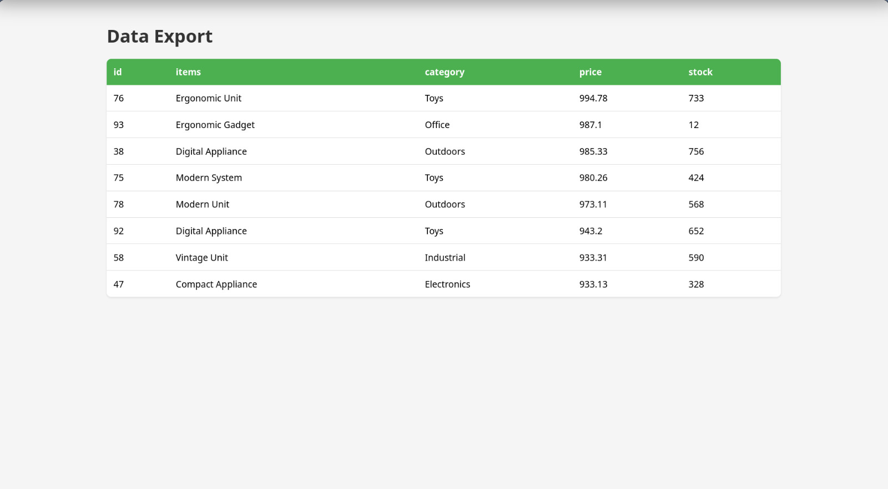

## Implementation: Markdown Output
*   The API can even generate a Markdown table with `?format=md`, useful for documentation or notes.

  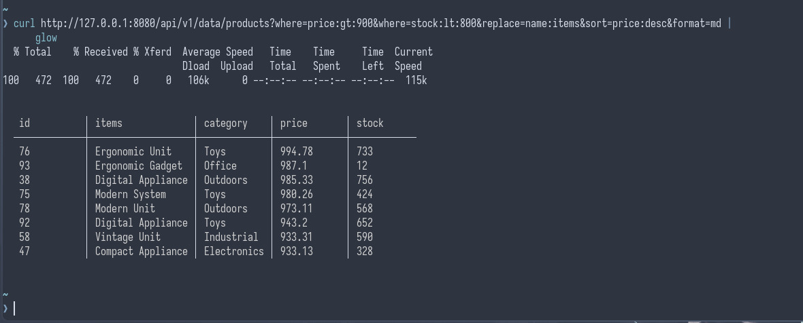

## Result: Demonstrated Outputs
*   created a **fully functional, standalone RESTful API server**.

*   The server is packaged as a single, runnable JAR file with no external frameworks required—it only needs a Java Virtual Machine.

## Result: How Objectives Were Met
  *   **Decoupling:** Achieved via the abstraction layer and view management.
*   **SQL Abstraction:** Achieved via the URL-based dynamic query engine.
*   **Transformation:** Achieved via the polymorphic `Exporter` module.
*   **Security:** Achieved via the API key and RBAC implementation.

## Result: Comparison with Expected Results
*   Our goal was to create a working prototype that proved the core concepts.

*   The final result exceeded expectations, delivering a stable, light-weight  and highly functional application that is ready for initial use.
- Implemented RBAC which wasn't in the inital plan.
- well abstracted code with well defined modules.

## Future Scope: Features
*   **Enhanced Querying:** Add support for `JOIN` operations between tables through the API.
*   **Logical Operators:** Implement support for complex `OR` conditions in `where` clauses.

## Future Scope: Improvements
*   **Performance:** Introduce a caching layer (e.g., using Caffeine or Ehcache) to store results of frequent queries, reducing database load.

*   **User Experience:** Develop a simple GUI Admin Panel (web interface) for managing API keys, views, and browsing data.
* **Key Revoke** Implement revoking key incase of security breach.

## Future Scope: Scalability
*   **Database Support:** Add official support and testing for enterprise-grade databases like PostgreSQL and MySQL.

*   **Deployment:** Create a **Docker image** for easy, containerized deployment in any environment.

## Conclusion: Summary of Achievement
*   We successfully designed and built a lightweight, powerful, and flexible data gateway that solves the critical problem of tight coupling in modern software.

*   The project is a case study in applying core OOP principles to build an elegant and maintainable solution without relying on heavy frameworks like spring.
* Achieved all of the core functionality with little to no dependancy of any external packages.

## Conclusion: Importance in Real-World Applications
*   This tool dramatically **reduces development time and costs** by eliminating repetitive client-side code.

*   It improves **system stability and resilience** by decoupling components.

*   It enhances **security** by providing a centralized and managed access point to data.

## Conclusion: Overall Learning Experience
*   This project provided deep, practical experience in applying OOP principles (Encapsulation, Inheritance, Polymorphism, Abstraction) to build a real-world application from the ground up.

*   It reinforced the importance of good architectural design and the long-term benefits of creating a modular, loosely coupled system.

# Q & A
# THANK YOU